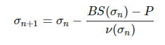
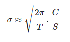
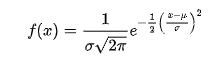

<h1> Options Calculations in C++ </h1>

* Option pricing using Black-Scholes
* Implied volatility calc

<h2> TO DO </h2>

* Correct implied vol calc rather than trial and error
* Add all greeks

* Proper understanding of normal distribution implementations https://en.wikipedia.org/wiki/Normal_distribution
* Implement cdf integral in code from pdf?
* Proper understanding of BS maths and Greek implementation (consider textbook)
* Implement greeks and brownian motion etc
* Implement SMILE
* Boole's rule? https://quantlabs.net/blog/2014/04/quant-analytics-options-pricing-greeks-delta-gamme-vega-rho-theta-c-programming/
* Eventually consider connecting to some options data and drawing conclusions
* Implementation of some graphics/models
* Consider implementing GUI

<h3> Black-Scholes </h3>

The Blach-Scholes option pricing model provides a closed-form pricing formula for a European type option.

There is no closed-form inverse for it (unsure why, perhaps distributions?).

<h3> Implied Volatility </h3>

Implied volatility is a calculation that uses an option's Vega (its sensitivity to change in volatility) to derive an estimate of volatility.

There is no closed-form inverse to the Black Scholes formula, however, it has a closed-form vega (volatility derivative) closed-form solution with a nonnegative derivative.

Therefore, we can use the Newton-Raphson formula to compute IV. Iterate the below until we have reached a solution of sufficient accuracy.

For our initial estimate we can use a closed form estimate of IV provided by [Brenner and Subrahmanyam (1988)](http://www.cfapubs.org/doi/abs/10.2469/faj.v44.n5.80).

<h3> Normal Distribution </h3>

https://support.microsoft.com/en-us/office/norm-dist-function-edb1cc14-a21c-4e53-839d-8082074c9f8d

General form of normal distribution's probability density function is:

Cumulative density function is the integral (area under the curve) from negative infinity to x of the given formula.

<h3> Normal distribution functions (pdf and cdf; probability density and cumulative density functions) </h3>

<h3> What else to include? </h3>

* Max loss
* Max return
* Profit probability
* SMILE curve?
* Theta decay?
* Interactive interface?

* Could add a header file to define class and functions but unecessary for now. If multiple uses/implementations then maybe

<h3> Useful reference links </h3>

* https://goodcalculators.com/black-scholes-calculator/
* https://github.com/EsterHlav/Black-Scholes-Option-Pricing-Model (Java implementation useful - Geometric Brownian Motion)
