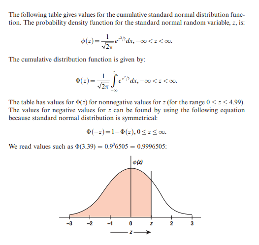

<h1> Options Calculations in C++ </h1>

* Option pricing using Black-Scholes
* Implied volatility calc

<h3> Normal distribution functions (pdf and cdf; probability density and cumulative density functions) </h3>

<h3> What else to include? </h3>

* Max loss
* Max return
* Profit probability
* SMILE curve?
* Theta decay?
* Interactive interface?

<h3> Useful reference links </h3>

* https://goodcalculators.com/black-scholes-calculator/
* https://github.com/EsterHlav/Black-Scholes-Option-Pricing-Model (Java implementation useful - Geometric Brownian Motion)
